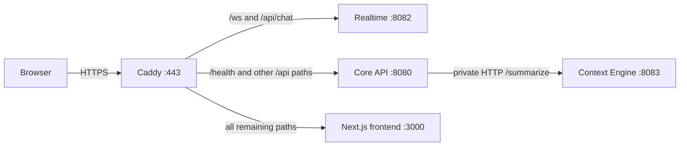

# API gateway in Orchestrix

## What we use

The production entry point is **Caddy 2**, configured as a reverse proxy in [`deploy/Caddyfile`](../deploy/Caddyfile). It serves `orchestrix.mrt.lk` and sends each request to the appropriate container. The older [`backend/implementation_plan.md`](../backend/implementation_plan.md) mentions Nginx, but the current deployment uses Caddy; there is no Nginx service in the production Compose file.

## How a request moves through the system

1. DNS sends `orchestrix.mrt.lk` to the EC2 instance. Caddy listens on public ports 80 and 443, obtains and renews the HTTPS certificate, and handles HTTPS for the browser.
2. Caddy checks paths in the order written in its `route` block. `/ws` and `/ws/*` (the SockJS/STOMP chat connection) plus `/api/chat` and `/api/chat/*` (chat HTTP endpoints) go to **Realtime** on port 8082.
3. `/health`, `/api`, and `/api/*` go to **Core API** on port 8080. Because the Realtime rules run first, `/api/chat/*` reaches Realtime even though it also matches `/api/*`.
4. Everything else, such as `/` and frontend pages, goes to **Next.js** on port 3000. Caddy forwards the original path; the Caddyfile does not strip prefixes.

For example, `GET https://orchestrix.mrt.lk/api/projects` reaches Core API, `GET https://orchestrix.mrt.lk/api/chat/projects/123/messages` reaches Realtime, and `GET https://orchestrix.mrt.lk/lead-dashboard` reaches Next.js.

The Context Engine is **not a public gateway destination**. For `POST /api/ai/summarize`, Caddy selects Core API. Core API checks the user and project access, then calls `http://context-engine:8083/summarize` over the private Compose network. See [`SummaryController`](../backend/core-api/src/main/java/com/example/core_api/ai/SummaryController.java) and [`SummaryProxy`](../backend/core-api/src/main/java/com/example/core_api/ai/SummaryProxy.java).

## What Caddy does and what the services do

Caddy provides one public HTTPS origin and path-based routing. The Caddyfile has no authentication, authorization, tenant selection, rate limiting, or load-balancing rules. The backend services handle their own security. For example, Core API's Spring Security filters process the bearer token and `X-Tenant-ID` header, while Realtime checks chat connection credentials. The browser's production API, chat API, and chat WebSocket URLs all use the same public origin; the deployment settings are described in [`deploy/README.md`](../deploy/README.md).

The services share a private Docker Compose network. Only Caddy publishes ports 80 and 443 publicly. The Core API, Realtime, and frontend ports are also bound to EC2's loopback interface for local health checks; Context Engine port 8083 is only exposed inside the Compose network. These bindings are in [`deploy/compose.ec2.yml`](../deploy/compose.ec2.yml).

## Local development and deployment

Local development scripts generally connect directly to `localhost:3000`, `localhost:8080`, and `localhost:8082`; they do not start the production Caddy gateway. The production workflow in [`.github/workflows/deploy-ec2.yml`](../.github/workflows/deploy-ec2.yml) copies the Caddyfile and Compose file to EC2, starts the application containers, then starts Caddy and checks the public HTTPS URL.
