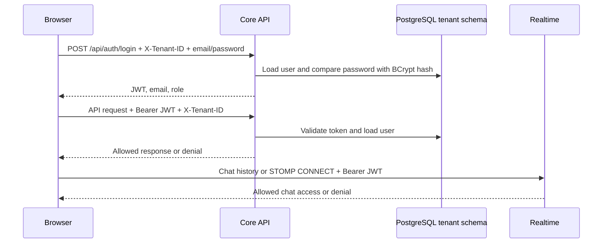

# How authentication works in Orchestrix

## Overview

Orchestrix uses **Core API's own email/password login and signed JSON Web Tokens (JWTs)**. Spring Security handles HTTP authentication. The Realtime service validates the same tokens for chat. Caddy routes requests but does not authenticate them. Although the application uses a Supabase-hosted PostgreSQL database, the sign-in page calls Core API's `/api/auth/login`; it does not use Supabase Auth for this flow.

## Registration and login

1. The user supplies an organization slug, email, and password. The browser sends the slug as `X-Tenant-ID` to `POST /api/auth/register` or `POST /api/auth/login`. The Core API maps a slug such as `acme` to PostgreSQL schema `org_acme`; a missing slug defaults to `myorg`. The tenant context is set before the user lookup.
2. Registration requires an email and a password of at least eight characters. Core API hashes the password with **BCrypt** and saves the hash in that tenant's `users` table. The first registered user in a tenant becomes `ADMIN`; later users become `MEMBER`. Registration currently marks the account active and does not require email verification.
3. Login uses Spring Security's `AuthenticationManager` to compare the supplied password against the stored hash and check account status. On success, Core API returns `{ token, email, role }`. Registration also returns a token, though the current sign-up page sends the user to sign-in afterward.

Sources: [`AuthController`](../backend/core-api/src/main/java/com/example/core_api/auth/AuthController.java), [`AuthService`](../backend/core-api/src/main/java/com/example/core_api/auth/AuthService.java), and the [sign-in page](../frontend/orchestrix_orbit_frontend/app/page.tsx).

## What is in the token

Core API signs the JWT with **HMAC-SHA256** using `JWT_SECRET`. It includes the user's email as the subject, their role, the tenant schema, issue time, and expiry. The default lifetime is **24 hours** (`JWT_EXPIRATION_MS` can change it). Core API and Realtime must use the same signing secret in deployment.

The browser stores the token, role, email, and tenant slug in `localStorage`. Its API helper sends `Authorization: Bearer <token>` and `X-Tenant-ID: <slug>` on later requests. Logout removes those local values. The frontend's role-based redirect is for navigation; the server makes the access decision.

Sources: [`JwtService`](../backend/core-api/src/main/java/com/example/core_api/auth/JwtService.java), [`lib/auth.ts`](../frontend/orchestrix_orbit_frontend/lib/auth.ts), [`lib/api.ts`](../frontend/orchestrix_orbit_frontend/lib/api.ts), and [`deploy/compose.ec2.yml`](../deploy/compose.ec2.yml).

## How protected requests are checked

For Core API requests, `TenantFilter` selects the tenant schema from `X-Tenant-ID` first. `JwtAuthFilter` then verifies the token signature and expiry, loads the email's user from that schema, and confirms that the JWT's tenant claim matches the selected schema. Spring Security treats a missing or invalid token as unauthenticated. Most API routes require authentication; selected routes also require `ADMIN` or `OWNER`. Login, registration, health, and error routes are public. Tenant creation is separately guarded by an admin account or deployment bootstrap key.

Chat has its own checks in Realtime. HTTP chat history requests require a valid Bearer token, a matching `X-Tenant-ID`, and access to the requested project. For live chat, the browser sends the Bearer token in the **STOMP `CONNECT` headers**. Realtime verifies it and checks tenant and project access when the client subscribes or sends a message. The WebSocket/SockJS URL is `/ws`; chat history is under `/api/chat`. Realtime checks the JWT with the shared secret rather than asking Core API to validate every chat request.

Sources: [`SecurityConfig`](../backend/core-api/src/main/java/com/example/core_api/config/SecurityConfig.java), [`TenantFilter`](../backend/core-api/src/main/java/com/example/core_api/multitenancy/TenantFilter.java), [`JwtAuthFilter`](../backend/core-api/src/main/java/com/example/core_api/config/JwtAuthFilter.java), [`ChatTokenVerifier`](../backend/realtime-service/src/main/java/com/example/realtime_service/chat/ChatTokenVerifier.java), [`ChatHttpAuthFilter`](../backend/realtime-service/src/main/java/com/example/realtime_service/chat/ChatHttpAuthFilter.java), and [`ChatChannelInterceptor`](../backend/realtime-service/src/main/java/com/example/realtime_service/config/ChatChannelInterceptor.java).

## Current boundaries

- The browser only checks whether a token is present in `localStorage`; the server checks whether it is valid. There is no refresh-token or server-side logout/revocation flow in this implementation, so a previously issued token remains usable until it expires unless the server rejects it for another reason.
- The tenant header chooses the schema, but the signed JWT must name that same schema. Changing the header alone cannot move an authenticated request to another tenant.
- Caddy provides HTTPS and routing; authorization remains in Core API and Realtime. See [API gateway explainer](API_GATEWAY.md).
